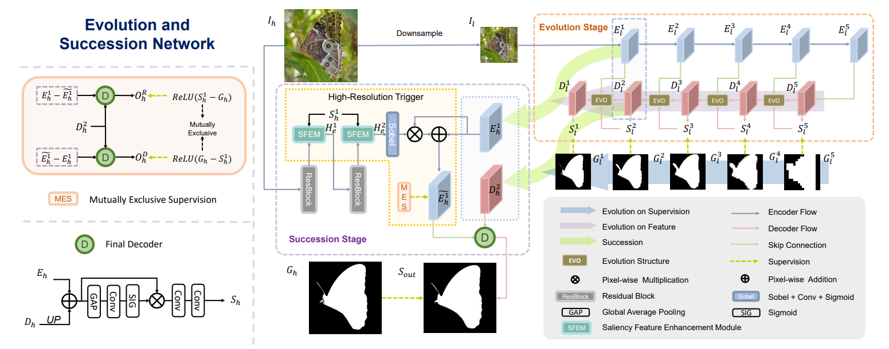

# ESNet 

Hongyu Liu, Runmin Cong, Hua Li, Qianqian Xu, Qingming Huang and Wei Zhang, ESNet: Evolution and Succession Network for High-Resolution Salient Object Detection, Forty-first International Conference on Machine Learning (ICML), 2024.
## Network

### Our overall framework：




## Requirement

Pleasure configure the environment according to the given version:

- python 3.9.0
- torch 1.13.1
- torchvision 0.14.1
- opencv-python 4.9.0.80
- numpy 1.26.4

We also provide requirement file for environment configuration, and you can use `pip install -r requirements.txt` to create a required environment.

## Preprocessing

Please follow the tips to download the processed datasets and pre-trained models:

Download HR/NRSOD dataset from [[Link](https://pan.baidu.com/s/1SDwGH6yUQ_yMGAv6ndR07A?pwd=mvpl)], code: mvpl.

The pretrained backbones can be download here: [[Link](https://pan.baidu.com/s/1Nmd9h-LWV2WCxftYbQmy8g?pwd=mvpl)], code: mvpl.

The trained models for ESNet can be download here: [[Link](https://pan.baidu.com/s/1Yyvqwwe94NhZEIc1IcKY4g?pwd=mvpl)], code: mvpl.


## Training and Testing

**Training command** :

```python
#First stage
cd fir
python train.py # train_trans.py for transformer version

#Second stage
cd sec
python sec_train.py # sec_trans_train.py for transformer version
```


**Testing command** :


```python
cd sec
python sec_test.py # sec_test_trans.py for transformer version
```

## Evaluation
We use Toolkit [[Link](https://github.com/zyjwuyan/SOD_Evaluation_Metrics)] to obtain the test metrics.

For Boundary Detail-aware Mean Absolute ErrorE metric, please set path in `/sec/eval_MAEBD.py` and run.
```python
cd sec
python eval_MAEBD.py
```

## Results

**Qualitative results**: we provide the saliency maps, and you can download them from [[Link](https://pan.baidu.com/s/1Uhrd_7HnIDHQYXJMfrhS7A?pwd=mvpl)], code: mvpl.


## Bibtex
```
@inproceedings{liu2024esnet,
  title={ESNet: Evolution and Succession Network for High-Resolution Salient Object Detection},
  author={Hongyu Liu and Runmin Cong and Hua Li and Qianqian Xu and Qingming Huang and Wei Zhang},
  booktitle={ICML},
  year={2024}
}
```
## Contact Us
If you have any questions, please contact Runmin Cong at [rmcong@sdu.edu.cn](mailto:rmcong@sdu.edu.cn) or Hongyu Liu at [liu.hongyu@bjtu.edu.cn](mailto:liu.hongyu@bjtu.edu.cn).

